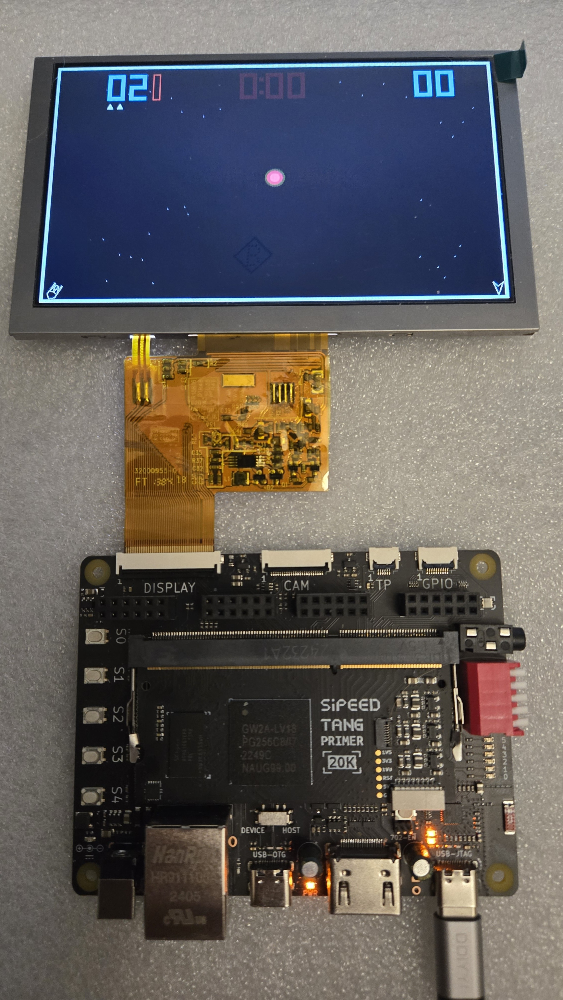
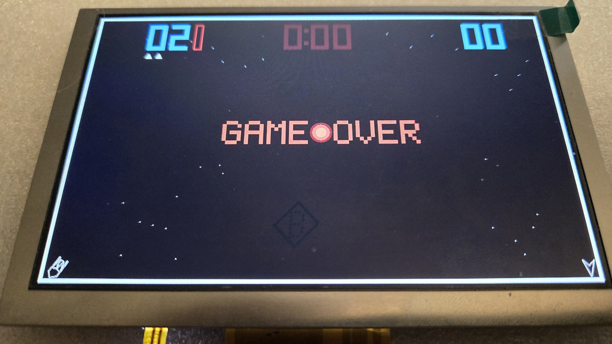

# Sipeed Tang Primer 20K demo

**This is starting to look like a real game.** Still a work in progress on FPGA — expect more changes — but the match loop (timer, lives, fuel, sun / black hole) plays through on the Dock + 5" LCD.

A **space ship fighting game** on the **Sipeed Tang Primer 20K Dock** with the **5" 800×480 RGB LCD**. You fly a TOS-style Enterprise; a yellow AI wedge hunts and shoots. Vector outlines, orange sun (and black hole), bounce walls, scores, fuel, and a countdown. Inspired by the 1977 *Space Wars* arcade (sun, thrust, shots) but this is original HDL — not a ROM dump.

Version **0.2.0** — see [CHANGELOG.md](CHANGELOG.md).

## Hardware

| Item | Used here |
|---|---|
| Board | Sipeed Tang Primer 20K Dock |
| FPGA | Gowin GW2A-LV18PG256C8/I7 (GW2A-18C), 46 BSRAM |
| Display | 5" 800×480 RGB LCD (RGB565, 5 px white border) |
| Clock | 27 MHz on H11 → rPLL **33 MHz** pixel clock |
| Tools | Gowin FPGA Designer (synthesize / program) |

**DIP switch 1 down.** Keys are active-low. Dock buttons sit on a **1.5 V** bank (`LVCMOS15`); LCD, clock, and reset are **3.3 V** (`LVCMOS33`).

| Button | Pin | Action |
|---|---|---|
| S1 | T3 | Rotate left |
| S2 | T2 | Rotate right |
| S3 | D7 | Thrust |
| S4 | C7 | Fire |
| S0 | T10 | Reset |

You fly a top-down TOS-style Enterprise. The other ship is an Asteroids-style wedge (AI). Thrust flame comes from the middle of the hull.

## Scoreboard

Pong-style **block digits** at the top of the LCD: **player left**, **AI right** (bright light blue), and a **M:SS countdown** in the center (starts at **1:30**). Timer turns **yellow** under 0:30 and **red** under 0:10. **Three score digits** each with **leading-zero blanking** (range −999 to 999). If a score goes below zero, a minus bar appears. Under the **player** score are **wedge life icons** (start with 3, max 5); a shot that kills you removes one. Every **5 AI kills** grants an extra life if you have fewer than 5. To the right of the player score is a **vertical fuel bar** (same height as the score digits, **15 s** of thrust): **green**, **yellow** at ≤10% left, **red** at ≤5%; empty means no thrust until you respawn with a full tank. The AI has **unlimited** ships (no life icons, never ends the game by AI deaths). **S0** reset clears scores, player lives, fuel, and the timer.

| Event | Player (left) | AI (right) | Timer |
|---|---|---|---|
| Your shot destroys the AI | +1 | — | +5 s |
| AI shot destroys you | — | +1 | +5 s |
| Ships crash into each other | −1 | −1 | — |
| Hit the sun / bounce a wall | no score change | no score change | — |

A crash also bounces the ships apart so it only counts once. Shot kills still boom (expanding X) then respawn (AI always; player only if lives remain).

**Game over.** When the timer reaches **0:00**, or the player has **no lives left**, play freezes and block **GAME OVER** flashes in the center of the screen (2 times per second, 50% duty).

## How it works

**Scanout.** Overlay stack, back to front: HUD → 2-bit FB ink (Enterprise green, AI/shots white) → star ROM → sun / black hole. **GAME OVER** on top. Colors are written when vectors are stroked, not guessed from ship boxes.

**Modules.** Game logic is split: `sw_physics.v` (AI, gravity, shots, scores), `sw_draw.v` (erase/stroke/boom), `sw_scanout.v` (LCD composite). `space_wars.v` is thin glue plus shared `sin_cos` / `fb_ram`. Shots use one indexed bank of 4 (player + up to 3 AI). Constants are local to each module (Gowin Education does not reliably `` `include `` headers).

**Framebuffer.** 800×470 **2-bit** BRAM (color at draw: empty / player / AI / shots). Full 800×480×2 overflows the 20K’s 46 BSRAM, so the bottom 10 LCD lines stay black. Stars are a tiny coordinate ROM at scanout (in front of ships). Double-buffering does not fit; erase/redraw is used after a boot clear.

**Sun.** Not stored in the FB. During scanout it is composited as an orange circle at (400, 240), radius 18, **in front of the ships**. Hitting the sun (or black-hole / restored-sun core) **costs the player a life**. After **10 shots** hit the sun, it becomes a **black hole** with **1/r²** gravity (thrust can still fight it) and a **red border**. **5 player shots** into the hole restore the sun with **outward 1/r²** push.

**Ships.** Vertex outlines, `sin_cos.v`, Q8.8 positions. Enterprise **green**, AI **bright yellow**, shots white. Mag: **5 shots / ~500 ms**, then **500 ms** reload; one shot per tap.

**AI.** Hidden elapsed time ramps thrust and aim; hunts by closing range and turning smoothly; by **2:30** it fires when locked on.

**Stars.** 28-point ROM at scanout, in front of ships.

Per-frame flow (simplified): physics → bounce / sun / shots → erase old vectors → stroke ships → shot streaks → boom.

## Source (what Gowin builds)

Project: [`fpga/tang20k_lcd/tang20k_lcd.gprj`](fpga/tang20k_lcd/tang20k_lcd.gprj)

| File | Role |
|---|---|
| `src/top.v` | Glue: PLL, LCD, game, buttons |
| `src/gowin_rpll.v` | 27 → 33 MHz rPLL |
| `src/lcd_timing.v` | 800×480 timing, border, `frame_start` |
| `src/space_wars.v` | Game glue: FB, sin_cos, handshakes |
| `src/sw_physics.v` | Physics, AI, shot bank, scores, sun/BH |
| `src/sw_draw.v` | Erase / stroke ships / shots / boom |
| `src/sw_scanout.v` | HUD, stars, sun, FB color → RGB |
| `src/fb_ram.v` | 2-bit 800×470 BRAM |
| `src/sin_cos.v` | Quarter-wave sine/cosine |
| `src/tang20k_lcd.cst` | Pin constraints |
| `src/tang20k_lcd.sdc` | 27 MHz clock constraint |

## Build

1. Open `fpga/tang20k_lcd/tang20k_lcd.gprj` in Gowin FPGA Designer.
2. Synthesize / place & route for **GW2A-LV18PG256C8/I7**.
3. Program the Dock. DIP 1 down, LCD seated.

If you keep a separate Gowin tree, copy **all** of `fpga/tang20k_lcd/src/*.v` into that project, add `sw_physics.v` / `sw_draw.v` / `sw_scanout.v` to FileList, and rebuild. Do **not** add a `.vh` (or `SW_common.vh.v`) as a design file — Gowin will treat it as root-scope Verilog and fail.

## License

MIT — see [LICENSE](LICENSE). Early demo code, no warranty, not finished software.
